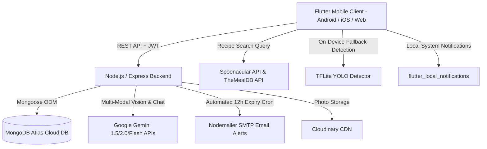

# 🍽️ BITEZ: Smart Leftover Food Manager — Comprehensive Project Report

**Date:** September 2026  
**Project Name:** Bitez (Smart Leftover Food Manager)  
**Repository:** `Dithin-Krishna/Bitez-Smart-Leftover-Food-Manager`  
**Application Type:** Full-Stack Mobile Application (Flutter + Node.js/Express + MongoDB Atlas + Google Gemini AI)  
**Deployment Status:** Live Cloud Backend on Render (`https://bitez-smart-leftover-food-manager.onrender.com`)

---

## 1. Executive Summary

Food waste is one of the leading global environmental and economic challenges, with a massive portion of household food discarded due to forgotten ingredients, lack of cooking inspiration, or passing expiration dates. 

**Bitez** solves this by acting as an intelligent kitchen companion. Using on-device and cloud-based computer vision (YOLO + Google Gemini Vision), Bitez identifies raw ingredients and leftovers from camera snapshots, tracks fridge inventory and expiry dates, generates tailored recipes based strictly on what is available, and provides an interactive AI culinary assistant (Chef Bitez) to eliminate food waste.

---

## 2. System Architecture & Tech Stack

### Component Details
* **Frontend (`bitez_app`)**:
  * **Framework:** Flutter SDK (`^3.12.2`), Dart
  * **State Management:** `provider` (`^6.1.2`)
  * **Local Storage:** `shared_preferences`, `path_provider`
  * **Image & ML Processing:** `image_picker`, `tflite_flutter`, `image`
  * **Notification Engine:** `flutter_local_notifications`
  * **Networking:** Resilient multi-tier candidate probing (`api_service.dart`) with reactive connection status
* **Backend (`bitez_backend`)**:
  * **Runtime:** Node.js (>=18.0.0), Express.js
  * **Database:** MongoDB Atlas via Mongoose
  * **Authentication:** Stateless JWT tokens + `bcryptjs` password hashing
  * **Scheduled Tasks:** Node interval scheduler (`expiryScheduler.js`)
  * **External APIs:** Google Gemini Vision & Language API, Spoonacular, TheMealDB, Cloudinary, Gmail SMTP

---

## 3. Module Breakdown & Implementation Status

| Feature Module | Implementation Details | Current Status |
| :--- | :--- | :--- |
| **Authentication & Profile** | JWT auth, auto-login persistence, password reset flow via email, dietary preference configuration (Vegan, Keto, Halal, etc.), max cooking time limits, custom avatar flipper. | ✅ **100% Operational** |
| **Hybrid Food Recognition** | 6-Phase pipeline: Camera capture $\rightarrow$ local YOLO hints $\rightarrow$ Gemini Vision scene analysis $\rightarrow$ Food catalog validation $\rightarrow$ User confirmation UI $\rightarrow$ MongoDB Virtual Fridge. | ✅ **100% Operational** |
| **Virtual Fridge Inventory** | Organized by 7 sections (Dairy, Veggies, Fruits, Meat, Pantry, Leftovers, Beverages), quantity step controls, item deletion, manual add modal, search filter. | ✅ **100% Operational** |
| **Multi-API Recipe Engine** | Tri-tier algorithm blending Spoonacular + TheMealDB + Local Quick Dishes dataset. Ranked by fewest missing ingredients and leftover match ratio. | ✅ **100% Operational** |
| **Chef Bitez AI Assistant** | Full-screen conversational AI powered by Gemini with automatic context injection of current fridge inventory and user dietary preferences. History persistence and quick suggestions. | ✅ **100% Operational** |
| **Expiry Tracker & Alerts** | Dual alerting: Real-time UI countdown badges + Android local notifications + 12-hour automated backend cron sending email warnings for items expiring in $\le 48$ hours. | ✅ **100% Operational** |
| **Grocery / Restock List** | Shopping list categorized by food type with check-off mechanics and one-tap transfer of bought items into the fridge. | ✅ **100% Operational** |
| **Cloud Deployment** | Docker-less Node web service on Render with automatic environment variable synchronization and fallback routing. | ✅ **100% Operational** |

---

## 4. Key Strengths of the Project

1. **Robust Network Resiliency**: The Flutter client automatically routes through live Render production servers, local USB ADB reverse, local Wi-Fi IP, or emulator loopback without crashing, showing a real-time connection status dot.
2. **True Anti-Waste Philosophy**: Recipes are sorted strictly to maximize the use of expiring and on-hand ingredients before requiring extra grocery shopping.
3. **Multi-Modal AI Integration**: Combines Gemini Vision and Gemini Chat with localized data catalogs to prevent hallucinated non-food items.
4. **End-to-End Notification Loop**: Users are notified via in-app banners, push alerts, and automated emails before food spoils.

---

## 5. Summary & Hand-off

The core vision of Bitez is achieved: a complete, production-ready full-stack application that transforms raw leftovers into curated recipes while managing household food shelf-life. Refer to [TODO.md](file:///c:/Users/dithinkrishna/Desktop/mini/TODO.md) for planned future iterations and feature enhancements.
